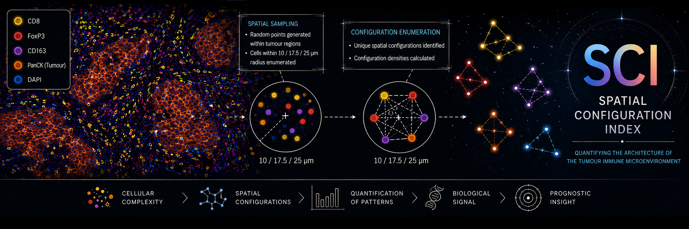

# 
 The Spatial Configuration Index (SCI) 

#### 
 The contained code was developed to analyze multiplex immunofluorescence data generated through AstroPath 

#### 
Contact: 16mrf6@queensu.ca

# Description
This code generates a Spatial Configuration Index (SCI) from a WSI database with the AstroPath schema. It works by first creating intermediary databases containing the counts of each unique spatial configuration per specimen using SQL, then transitioning to Python to compute the sum of select weighted spatial configuration densities per specimen, resulting in a single value for each specimen.

# Usage
The SQL script plugs into the AstroPath database housing the Melanoma Cohort- running will generate 3 additional databases containing the frequency counts of unique spatial configurations at 10-, 17.5-, and 25-micron scale. The Jupyter notebook requires auxillary spreadsheets available at Figshare (...). It will enumerate spatial configurations and produce a spatial configuration index per specimen.
